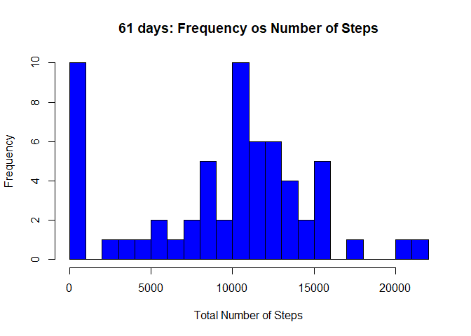
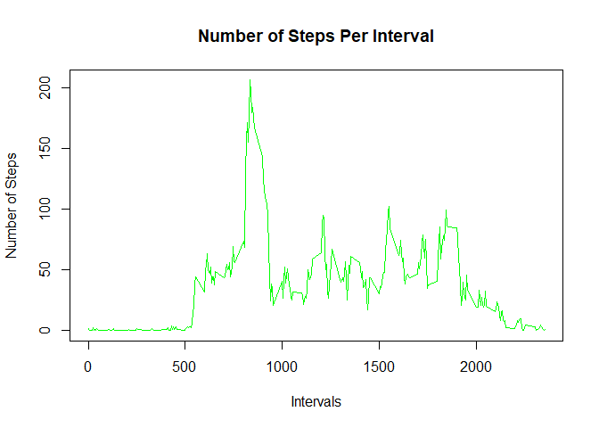
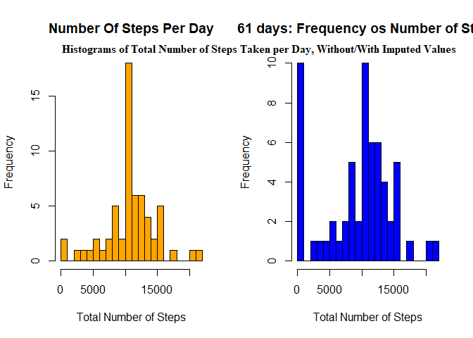
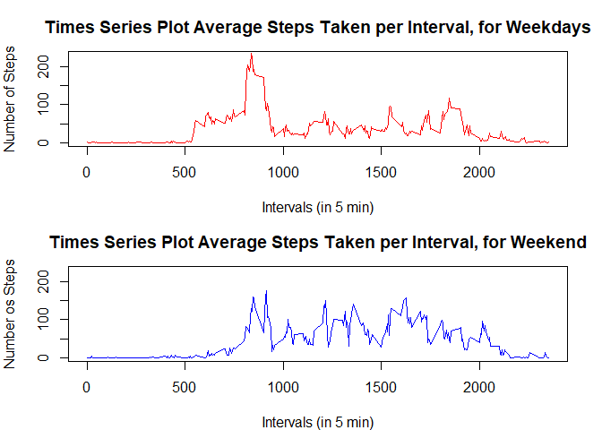

## 1 - Loading and preprocessing the data


```r
# 1.1 - Read csv data
unzip("activity.zip")
dataset <- read.csv("activity.csv", head = TRUE, sep = ",")

# 1.2 - make into date type
dataset$date <- as.Date(dataset$date, "%Y-%m-%d")
str(dataset)
```

```
## 'data.frame':	17568 obs. of  3 variables:
##  $ steps   : int  NA NA NA NA NA NA NA NA NA NA ...
##  $ date    : Date, format: "2012-10-01" "2012-10-01" ...
##  $ interval: int  0 5 10 15 20 25 30 35 40 45 ...
```

## 2 - What is mean total number of steps taken per day?


```r
# 2.1 - Calculate the total number of steps per day
stepsPerDay <- aggregate(dataset$steps, by = list(dataset$date), sum, na.rm = TRUE)
names(stepsPerDay) <- c("Date", "Total")
str(stepsPerDay)
```

```
## 'data.frame':	61 obs. of  2 variables:
##  $ Date : Date, format: "2012-10-01" "2012-10-02" ...
##  $ Total: int  0 126 11352 12116 13294 15420 11015 0 12811 9900 ...
```

```r
##2.2 - Histogram of total number of steps per day
hist(stepsPerDay$Total, breaks = 25, col = "blue",
     xlab = "Total Number of Steps",
     ylab = "Frequency",
     main = "61 days: Frequency os Number of Steps")
```

<!-- -->

```r
##2.2.1 - Copy Plot in png-file
if(!file.exists("./figure")){dir.create("./figure")}
dev.copy(png, filename = "./figure/plot1.png", width = 500, height = 400)
```

```
## png 
##   3
```

```r
dev.off ()
```

```
## png 
##   2
```

##Enter the mean and median of the total number of steps taken per day


```r
#2.3 - Calculating the mean and median of the total number of steps taken per day

meanPerDay <- mean(stepsPerDay$Total, na.rm = FALSE)
medianPerDay <- median(stepsPerDay$Total, na.rm = FALSE)

print(paste("The mean number of steps per day is", meanPerDay))
```

```
## [1] "The mean number of steps per day is 9354.22950819672"
```

```r
print(paste("The median number of steps per days is", medianPerDay))
```

```
## [1] "The median number of steps per days is 10395"
```
## 3 - What is the average daily activity pattern?


```r
#3.1 - Creating new dataset 5 minute interval
stepsPerInterval <- aggregate(dataset$steps, by = list(dataset$interval),
                              mean, na.rm = TRUE)
names(stepsPerInterval) <- c("interval", "steps")
head(stepsPerInterval)
```

```
##   interval     steps
## 1        0 1.7169811
## 2        5 0.3396226
## 3       10 0.1320755
## 4       15 0.1509434
## 5       20 0.0754717
## 6       25 2.0943396
```


```r
#3.1.1 - graphing activity by interval over the entire time period
plot(stepsPerInterval$interval, stepsPerInterval$steps, type = "l", col = "green",
     xlab = "Intervals",
     ylab = "Number of Steps",
     main = "Number of Steps Per Interval")
```

<!-- -->

```r
##3.1.2 - Copy Plot in png-file
dev.copy(png, filename = "./figure/plot2.png", width = 500, height = 400)
```

```
## png 
##   3
```

```r
dev.off ()
```

```
## png 
##   2
```


```r
# 3.2 - Calculating the maximum number of steps and the accompanying interval.
stepsPerInterval[grep(max(stepsPerInterval$steps), stepsPerInterval$steps), ]
```

```
##     interval    steps
## 104      835 206.1698
```

#### So the interval with the maximum number of steps is interval 835.

## 4 - Imputing missing values


```r
#4.1 - Discovering missing values by applying is.na to the steps field in the dataframe
naCount <- sum(is.na(dataset$steps))
print(paste("There are",naCount,"missing values in the steps-field of the dataset.")) 
```

```
## [1] "There are 2304 missing values in the steps-field of the dataset."
```

```r
#4.2 - Replacing missing values in the new dataset
newdataset <- data.frame(sapply(dataset,
                                function(x) ifelse(is.na(x),
                                                   mean(x, na.rm = TRUE),
                                                   x)))
```


```r
#4.2.1 - Checking for missing data in the new dataset
newnaCount <- sum(is.na(newdataset$steps))
print(paste("There are",newnaCount,"missing values in the steps-field of the newdataset."))
```

```
## [1] "There are 0 missing values in the steps-field of the newdataset."
```

```r
#4.3 - Creating a new dataset disregarding missing data
newStepsPerDay <- aggregate(newdataset$steps, by = list(newdataset$date), sum)
names(newStepsPerDay) <- c("Date", "Total")

#4.4 - Histograms
par(mfrow = c(1,2))

hist(newStepsPerDay$Total, breaks = 25, col = "orange",
     xlab = "Total Number of Steps",
     ylab = "Frequency",
     main = "Number Of Steps Per Day"
     )

hist(stepsPerDay$Total, breaks = 25, col = "blue",
     xlab = "Total Number of Steps",
     ylab = "Frequency",
     main = "61 days: Frequency os Number of Steps")

mtext("Histograms of Total Number of Steps Taken per Day, Without/With Imputed Values",
      adj=0.95, family="serif", font=2)
```

<!-- -->

```r
#4.4.1 - Copy Plot in png-file
dev.copy(png, filename = "./figure/plot3.png", width = 500, height = 400)
```

```
## png 
##   3
```

```r
dev.off ()
```

```
## png 
##   2
```


```r
#4.4.2 - Calculating the mean and median data set
newMeanPerDay <- mean(newStepsPerDay$Total)
newMedianPerDay <- median(newStepsPerDay$Total)

print(paste("The mean number of steps per day is", newMeanPerDay))
```

```
## [1] "The mean number of steps per day is 10766.1886792453"
```

```r
print(paste("The median number of steps per days is", newMedianPerDay))
```

```
## [1] "The median number of steps per days is 10766.1886792453"
```
###The mean number of steps per day was 9354.23 but with the NA’s replaced by the mean it is 10766.19.
###The median number of steps per day was 10395.00 but with the NA’s replaced by the mean it is 10766.19. Imputing of NAs has the following effect: Both the mean and the median number of steps have increased. There are considerable less days with 0 steps (2 versus 10) and considerable more days with 10000 tot 11250 steps.


## Are there differences in activity patterns between weekdays and weekends?


```r
#5.1 - Creating a new dataset with weekday and weekend variables
daysData <- dataset
daysData$days <- weekdays(daysData$date)
daysData$week <- as.character(rep(0, times = 17568))

for (x in 1:17568) {
  if(daysData[x, 4] %in% c("sábado", "domingo")){
    daysData[x, 5] <- "weekend"
  } else {
    daysData[x, 5] <- "weekday"
  }
}
daysData$week <- factor(daysData$week)

head(daysData)
```

```
##   steps       date interval          days    week
## 1    NA 2012-10-01        0 segunda-feira weekday
## 2    NA 2012-10-01        5 segunda-feira weekday
## 3    NA 2012-10-01       10 segunda-feira weekday
## 4    NA 2012-10-01       15 segunda-feira weekday
## 5    NA 2012-10-01       20 segunda-feira weekday
## 6    NA 2012-10-01       25 segunda-feira weekday
```

```r
#5.1.1 - Creating two datasets with weekday and weekend averages
weekdayData <- daysData[daysData$week == "weekday", ]
weekendData <- daysData[daysData$week == "weekend", ]

head(weekendData)
```

```
##      steps       date interval   days    week
## 1441     0 2012-10-06        0 sábado weekend
## 1442     0 2012-10-06        5 sábado weekend
## 1443     0 2012-10-06       10 sábado weekend
## 1444     0 2012-10-06       15 sábado weekend
## 1445     0 2012-10-06       20 sábado weekend
## 1446     0 2012-10-06       25 sábado weekend
```

```r
head(weekdayData)
```

```
##   steps       date interval          days    week
## 1    NA 2012-10-01        0 segunda-feira weekday
## 2    NA 2012-10-01        5 segunda-feira weekday
## 3    NA 2012-10-01       10 segunda-feira weekday
## 4    NA 2012-10-01       15 segunda-feira weekday
## 5    NA 2012-10-01       20 segunda-feira weekday
## 6    NA 2012-10-01       25 segunda-feira weekday
```

```r
weekdayMean <- aggregate(steps ~ interval, weekdayData, mean)
weekendMean <- aggregate(steps ~ interval, weekendData, mean)
```


```r
#5.2 - Creating time series charts for weekday and weekend
par(mfrow = c(2,1), mar = c(4, 4, 3, 2))

plot(weekdayMean$interval, weekdayMean$steps, type = "l",
     main = "Times Series Plot Average Steps Taken per Interval, for Weekdays",
     xlab = "Intervals (in 5 min)",
     ylab = "Number of Steps",
     col = "red",
     lwd = 1.5,
     ylim = c(0, 230))

plot(weekendMean$interval, weekendMean$steps, type = "l",
     main = "Times Series Plot Average Steps Taken per Interval, for Weekend", 
     xlab = "Intervals (in 5 min)",
     ylab = "Number os Steps",
     col = "blue",
     lwd = 1.5,
     ylim = c(0, 230))
```

<!-- -->

```r
#4.4.1 - Copy Plot in png-file
dev.copy(png, filename = "./figure/plot4.png", width = 500, height = 400)
```

```
## png 
##   3
```

```r
dev.off ()
```

```
## png 
##   2
```


